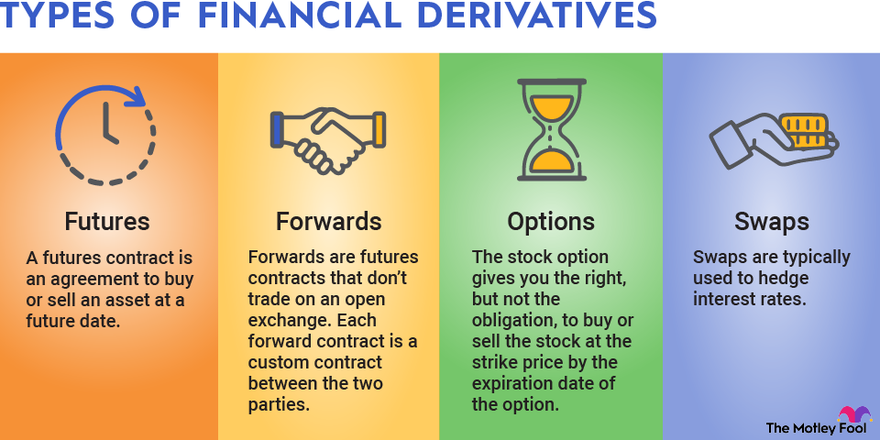

# **Generalidades y conceptos clave, ecuación de Black-Scholes**

En esta ocasión, se abordarán las siguientes temáticas:

* Introducción a los derivados financieros y su importancia.
* Explicación del marco de riesgo neutral y cómo se utiliza para valorar derivados.
* Derivación de la fórmula de *Black-Scholes* y explicación de sus componentes.

## **Derivados financieros, descripción e importancia**

Los derivados financieros son instrumentos financieros complejos que **derivan su valor de otro activo subyacente**, como acciones, índices, materias primas, divisas o tipos de interés. A diferencia de los activos subyacentes, los derivados no se negocian en propiedad, sino que se basan en un contrato entre dos partes que acuerdan un precio de compra o venta futuro.

Existen diversos tipos de derivados financieros, entre los más comunes se encuentran:

* **Opciones:** Otorgan el derecho, pero no la obligación, de comprar (opción de compra) o vender (opción de venta) un activo subyacente a un precio determinado (precio de ejercicio) antes o en una fecha específica (fecha de vencimiento).
* **Futuros:** Obligan a las partes a comprar o vender un activo subyacente a un precio y fecha predefinidos en el futuro.
* **Swaps:** Permiten intercambiar flujos de efectivo futuros entre dos partes, como el pago de intereses o el tipo de cambio.

> [!IMPORTANT]Importancia de derivados financieros
> Los derivados financieros desempeñan un papel fundamental en el sistema financiero moderno, pues estos permiten a los inversores protegerse contra el riesgo de movimientos adversos en los precios de los activos subyacentes, así como ofrecer la posibilidad de obtener ganancias apalancadas mediante la realización de apuestas sobre la dirección futura de los precios. Estas también facilitan la explotación de diferencias de precios entre diferentes mercados y contribuyen a la liquidez y eficiencia de los mercados financieros.

Ilustración de tipos de derivados financieros:

## **Marco de riesgo neutral (risk neutral), valoración de derivados**

El marco de riesgo neutral es un enfoque fundamental para la valoración de derivados financieros, este se basa en la idea de que el precio de un derivado debe ser igual al valor actual de la cartera de replicación que reproduce su pago al vencimiento.

> [!NOTE]Cartera de replicación
> Una cartera de replicación es una combinación de activos subyacentes y otros instrumentos financieros que genera un flujo de efectivo equivalente al pago del derivado al vencimiento.

Algunos puntos a destacar son:

* Dado el precio actual de la acción y las hipótesis sobre la 
dinámica del precio de las acciones, no hay incertidumbre sobre el 
precio de un derivado.

* El precio se define únicamente por el precio de la acción y no 
por las preferencias de riesgo de los participantes en el mercado.

* El aparato matemático permite calcular el precio actual 
de un derivado y sus riesgos, dados ciertos supuestos 
sobre el mercado.

Esto supone algunas ventajas y desventajas, tales como:

**ventajas:**

* Proporciona una base teórica sólida para la valoración de derivados.
* Permite comparar los precios de diferentes tipos de derivados.
* Facilita la construcción de estrategias de cobertura.

**Desventajas:**

* Requiere el uso de supuestos simplificados, como la ausencia de fricciones y la perfecta eficiencia del mercado.
* Puede ser difícil de aplicar en la práctica, especialmente para derivados complejos.

## **Derivación de la fórmula de Black-Scholes**

Inicialmente, se tiene que la expresión que forma la ecuación de Black-Scholes es una ecuación diferencial parcial (EDP) estocástica que rige la evolución del precio de los derivados según el modelo *Black-Scholes*.

> [!TIP]Modelo Black-Scholes
> Este modelo estima el valor teórico de derivados financieros basado en otros instrumentos de inversión teniendo en cuenta el impacto del tiempo y otros factores de riesgo.

La fórmula de Black-Scholes es una de las herramientas más utilizadas para la valoración de opciones financieras, y se tiene que esta fórmula se deriva a partir de la **ecuación de difusión de Ito**, que describe el movimiento aleatorio del precio de un activo subyacente a lo largo del tiempo.

Algunas consideraciones importantes de este modelo:

* El modelo Black-Scholes, también conocido como modelo Black-Scholes-Merton (BSM), es una ecuación diferencial muy utilizada para valorar contratos de opciones.
* El modelo Black-Scholes requiere cinco variables de entrada: el precio de ejercicio de una opción, el precio actual de las acciones, el tiempo hasta el vencimiento, el tipo sin riesgo y la volatilidad.
* Aunque suele ser preciso, el modelo Black-Scholes hace ciertas suposiciones que pueden llevar a predicciones que se desvían de los resultados del mundo real.
* El modelo estándar BSM sólo se utiliza para valorar opciones europeas, ya que no tiene en cuenta que las opciones americanas podrían ejercerse antes de la fecha de vencimiento.

La derivación se basa en la idea de que el precio de una opción refleja el valor actual de la oportunidad de comprar o vender el activo subyacente a un precio determinado en el futuro.

Considere una acción que no paga dividendos. Ahora construya cualquier derivado que tenga un tiempo de maduración fijo $T$ en el futuro, y en el momento de la maduración, tenga un pago $K(S_T)$ que dependa de los valores que tome la acción en ese momento (como las opciones de compra o venta europeas). Entonces el precio del derivado satisface la ecuación de *Black-Scholes* que está dada por:

$$ \frac{\partial V}{\partial t} + \frac12\sigma^2 S^2 \frac{\partial^2 V}{\partial S^2} + rS\frac{\partial V}{\partial S} - rV = 0 $$

En esta expresión, $V(t, S)$ es el precio de una opción como función de un precio de stock $S$ y un tiempo $t$, $r$ es la tasa de interés libre de riesgo y $\sigma$ es la volatilidad del stock.

La idea financiera clave que subyace a la ecuación es que, bajo el supuesto modelo de un mercado **sin fricciones**, se puede cubrir perfectamente la opción comprando y vendiendo el activo subyacente de la forma correcta y, en consecuencia, "eliminar el riesgo". Esta cobertura, a su vez, implica que sólo hay un precio correcto para la opción, como devuelve la fórmula de Black-Scholes.

**Referencias**

* https://www.fool.com/terms/f/financial-derivatives/
* https://en.wikipedia.org/wiki/Black%E2%80%93Scholes_equation
* https://www.investopedia.com/terms/b/blackscholes.asp
* https://www.youtube.com/watch?v=TnS8kI_KuJc
* https://ocw.mit.edu/courses/18-s096-topics-in-mathematics-with-applications-in-finance-fall-2013/resources/mit18_s096f13_lecnote19/